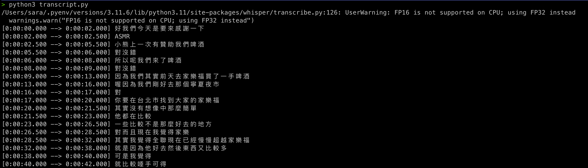

<a name="readme-top"></a>

<!-- 專案簡介 -->
## About The Project



Using OpenAI Whisper model to transfer audio into text on Mac. 

<p align="right">(<a href="#readme-top">back to top</a>)</p>

<!-- GETTING STARTED -->
## Getting Started

### Prerequisites

Install Python on your Mac. I am going to use `Python3.11` for this project.


### Installation

* Install package
  ```sh
  pip install -r requirements.txt
  ```
* If running on Mac M2 chips would need install `ffmpeg` 
    ```sh
    brew install ffmpeg
    ```

<p align="right">(<a href="#readme-top">back to top</a>)</p>

<!-- Additional screenshots, code examples and demos work -->
## Usage

1. Place your MP3 file into the `whisper-speech2text` folder within the root directory of the project.
2. Run the following command and wait for the process to complete:

    ```sh
    python3 transcript.py
    ```

    Note: This process may take some time.

3. Once the process is finished, you will find a `.txt` file with the same name as your MP3 file in the `whisper-speech2text` folder.


<p align="right">(<a href="#readme-top">back to top</a>)</p>

<!-- ROADMAP -->
## Roadmap

- [x] Generate Traditional Chinese speech to text file
- [ ] Streaming 

<p align="right">(<a href="#readme-top">back to top</a>)</p>

<!-- 其他相關資訊 -->
## Acknowledgments

* [Whisper Git Project]([https://file_path](https://github.com/openai/whisper))